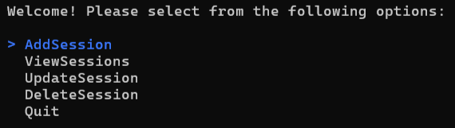
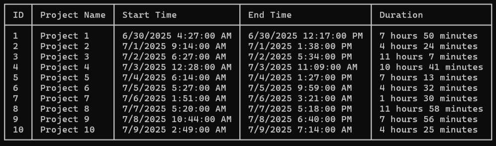

# Coding Tracker Console App

A simple .NET console application for tracking coding sessions. You can log your daily coding activity and track how many hours you've spent coding. Add a project name to better organize your data.

## Features

- Add new coding sessions
- View session history
- Edit or delete sessions
  
  

## Getting Started

1. Clone the repository:
   ```bash
   git clone https://github.com/andymartinez1/Console-Coding-Tracker.git
   ```
2. Navigate to the project directory:
   ```bash
   cd Coding-Tracker
   ```
3. Change the working directory in launchSettings.json to the root of the project. Example:

   ```bash
   "workingDirectory": "X:\\C#\\.NET-Console-Apps\\Coding-Tracker\\Coding-Tracker\\"
   ```

4. Build and run the app:
   ```bash
   dotnet run
   ```

## Technologies Used

- C#
- .NET Console Application
- Dapper
- SQLite
